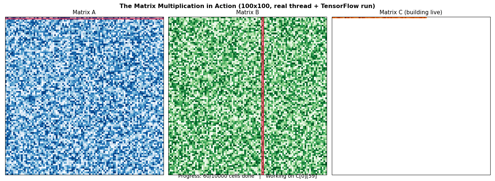

# OS_Task1
# 🧵 Multithreading Assignment

## 📌 Overview

This project demonstrates two important multithreading problems using **Java and Python**:

1. **Producer-Consumer Problem using Java Threads**
2. **Matrix Multiplication using Python Threads + TensorFlow with Animation**

The project demonstrates concepts such as **thread creation, synchronization, shared resources, thread pools, concurrent execution, TensorFlow computation, and visualization**.

---

## 📂 Files in this Repository

| File | Description |
| --- | --- |
| `ProducerConsumer.java` | Main class for the Producer-Consumer program |
| `SharedBuffer.java` | Shared circular buffer used by Producer and Consumer |
| `Producer.java` | Producer thread implementation |
| `Consumer.java` | Consumer thread implementation |
| `matrix_multiplication_animation.py` | 100×100 matrix multiplication using Threads + TensorFlow |
| `matrix_multiplication.gif` | GIF visualization of matrix multiplication |
| `README.md` | Project documentation |

---

# 1️⃣ Producer-Consumer Problem

## 📖 Description

The **Producer-Consumer Problem** is implemented using Java threads and a shared fixed-size circular buffer.

The **Producer** generates values and adds them to the shared buffer, while the **Consumer** removes the values from it. Since both threads access the same resource, synchronization is required to prevent race conditions and incorrect buffer operations.

The program uses a circular buffer of size **5**.

### ⚙️ Working

The `SharedBuffer` class stores the values shared between the Producer and Consumer. The `in` pointer determines where the next value should be inserted, while the `out` pointer determines where the next value should be removed.

The `produce()` and `consume()` methods are declared as `synchronized`, ensuring that only one thread accesses the shared buffer at a time.

If the buffer becomes full, the Producer executes:

```java
wait();
```

and waits until the Consumer removes an item.

Similarly, if the buffer becomes empty, the Consumer waits until the Producer inserts a new item.

After producing or consuming an item:

```java
notifyAll();
```

is used to wake any waiting thread.

The circular movement of the buffer is achieved using:

```java
in = (in + 1) % size;
out = (out + 1) % size;
```

---

## 🔹 Concepts Used

- Java Threads
- Producer and Consumer Threads
- Shared Resources
- Synchronization
- `synchronized`
- `wait()`
- `notifyAll()`
- Circular Buffer

---

## 🔹 Entry Point

```java
package task;

public class ProducerConsumer {

    public static void main(String[] args) {

        // Create shared buffer with capacity 5
        SharedBuffer buffer = new SharedBuffer(5);

        // Create Producer and Consumer
        Producer producer = new Producer(buffer);
        Consumer consumer = new Consumer(buffer);

        // Start both threads
        producer.start();
        consumer.start();
    }
}
```

---

## ▶️ How to Run

### Using Eclipse

1. Create a Java project.
2. Create the package `task`.
3. Add the Java files to the package.
4. Open `ProducerConsumer.java`.
5. Run it as a **Java Application**.

### Using Terminal

Compile:

```bash
javac task/*.java
```

Run:

```bash
java task.ProducerConsumer
```

---

## 🖥️ Sample Output

```text
Produced: 1
Consumed: 1
Produced: 2
Produced: 3
Consumed: 2
Produced: 4
Consumed: 3
...
```

> The exact order may vary because the Producer and Consumer execute concurrently.

---

# 2️⃣ Matrix Multiplication using Threads + TensorFlow

## 📖 Description

The second program performs multiplication of two **100×100 matrices** using Python threads and TensorFlow.

```text
Matrix A (100×100) × Matrix B (100×100)
                    ↓
             Matrix C (100×100)
```

The result matrix contains **10,000 cells**, so the program creates **10,000 individual cell-computation tasks**.

Each cell of Matrix C is calculated by taking one row from Matrix A and one column from Matrix B and calculating their dot product.

---

## ⚙️ How It Works

The program first generates two random **100×100 matrices** using TensorFlow.

`ThreadPoolExecutor` is then used to create a pool of worker threads. Each `(row, column)` position of Matrix C is submitted as an independent task.

For every result cell, the program selects:

```python
row_vector = matrix_a[row_index, :]
col_vector = matrix_b[:, col_index]
```

TensorFlow then calculates their dot product using:

```python
tf.tensordot(row_vector, col_vector, axes=1)
```

The resulting value is stored in the corresponding position of **Matrix C**.

---

## 🧵 Recording Thread Execution

The program contains an `ExecutionRecorder` that records the order in which cells are actually completed.

A:

```python
threading.Lock()
```

is used to make the recording process thread-safe.

Therefore, the animation is based on the **actual recorded completion order of the threaded computation**, rather than a predefined sequence.

---

## 🎬 Matrix Multiplication Animation

The animation contains three panels:

- 🔵 **Matrix A** – a red horizontal marker shows the current row.
- 🟢 **Matrix B** – a red vertical marker shows the current column.
- 🟠 **Matrix C** – calculated result cells gradually appear.

The animation visually demonstrates how a row from Matrix A and a column from Matrix B contribute to a cell in Matrix C.

### 🎥 Animation Output



The GIF above displays the recorded matrix multiplication process directly inside the GitHub README.

---

## 🔹 Concepts Used

- Python Multithreading
- `ThreadPoolExecutor`
- TensorFlow
- Matrix Multiplication
- `tf.tensordot()`
- Thread-Safe Recording
- `threading.Lock()`
- NumPy
- Matplotlib Animation
- GIF Visualization

---

## ▶️ Installation

Install the required Python packages:

```bash
pip install tensorflow numpy matplotlib pillow
```

---

## ▶️ Run

Run the program using:

```bash
python matrix_multiplication_animation.py
```

The program performs the real matrix multiplication, displays the execution time and sample result, and then generates/displays the matrix animation.

---

## 🖥️ Sample Output

```text
Running the real multiplication first, using 8 threads...

Computation complete.
The Time taken: XX.XX ms

Sample of the result (top-left 3x3):

[9977, 9301, 10034]
[9267, 9709, 10129]
[10500, 10056, 10206]
```

> The matrix values and execution time can change between runs because the matrices are randomly generated and execution depends on the system.

---

# 🛠️ Technologies Used

| Technology | Purpose |
| --- | --- |
| ☕ Java | Producer-Consumer implementation |
| 🐍 Python | Matrix multiplication |
| 🧵 Java Threads | Producer and Consumer execution |
| 🔐 Synchronization | Safe shared-buffer access |
| 🧵 ThreadPoolExecutor | Worker-thread management |
| 🤖 TensorFlow | Matrix cell computation |
| 🔢 NumPy | Matrix data handling |
| 📊 Matplotlib | Animation and visualization |
| 🖼️ Pillow | GIF support |

---

# 📋 Requirements

### ☕ Java

- JDK 8 or above

### 🐍 Python

- Python 3.9 or above
- TensorFlow
- NumPy
- Matplotlib
- Pillow

Install the Python dependencies using:

```bash
pip install tensorflow numpy matplotlib pillow
```

---

# 🎯 Learning Outcomes

Through this assignment, the following concepts are demonstrated:

- Creation and execution of threads
- Synchronization of shared resources
- Producer-Consumer communication
- Circular buffer implementation
- Use of `wait()` and `notifyAll()`
- Thread pools and concurrent tasks
- Matrix multiplication using TensorFlow
- Thread-safe execution recording
- Visualization of multithreaded computation

---

# 📌 Conclusion

This project demonstrates multithreading through two different applications. The **Producer-Consumer problem** shows how threads safely communicate through a synchronized shared buffer, while the **Matrix Multiplication problem** demonstrates how a large computation can be divided into thousands of tasks and processed using a thread pool.

The matrix animation further provides a visual representation of the recorded computation by showing the corresponding rows, columns, and result cells during the multiplication process.
